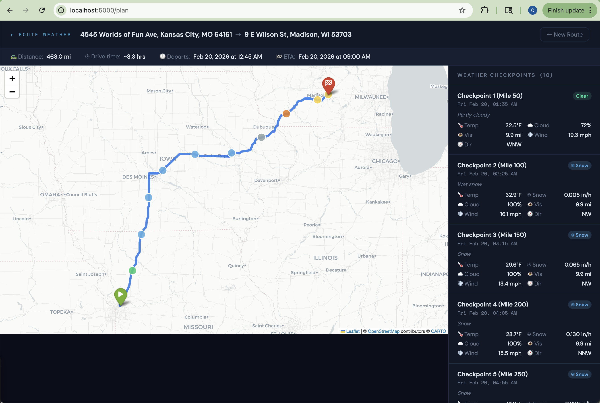

# Route Weather Planner 🗺️⛅

A Flask web app that shows weather forecasts at regular intervals along a driving route.
Enter a start address, end address, and departure time — and get an interactive map showing
what conditions you'll actually encounter at each checkpoint, based on when you'll arrive there.

<div style="display: flex; justify-content: space-around; margin-bottom: 20px;">
  
  
</div>

**Weather source:** Open-Meteo (free, no API key) using the ECMWF IFS 0.25° model — up to 16 days  
**Routing:** OpenRouteService (free, open-source)  
**Geocoding:** Nominatim / OpenStreetMap (completely free, no key required)

---

## Screenshots

The app has two screens:
1. **Input form** — enter addresses, departure time, checkpoint interval, and average speed
2. **Result page** — split-pane view with an interactive map on the left and a weather
   checkpoint sidebar on the right; click any marker for a detailed weather popup

---

## Setup

### 1. Clone and install

```bash
cd route_weather

# Create a virtual environment
python -m venv .venv

# Activate it
source .venv/bin/activate        # macOS / Linux
# .venv\Scripts\activate         # Windows (Command Prompt)
# .venv\Scripts\Activate.ps1     # Windows (PowerShell)

# Install dependencies into the venv
pip install -r requirements.txt
```

> **Tip:** You'll need to activate the venv (`source .venv/bin/activate`) each time you open
> a new terminal before running the app. You'll know it's active when you see `(.venv)` at
> the start of your prompt.

### 2. Get your API keys

#### OpenRouteService (routing)
1. Go to [openrouteservice.org/dev/#/signup](https://openrouteservice.org/dev/#/signup)
2. Create a free account (no credit card required)
3. Go to **Dashboard → Tokens** and copy your API key
4. Free tier: **2,000 requests/day**, 40/min — plenty for personal use

#### Open-Meteo (weather)
No setup needed. Open-Meteo is completely free, requires no account or API key, and serves
ECMWF IFS forecasts at 0.25° resolution with up to 16-day hourly forecasts.
See [open-meteo.com](https://open-meteo.com) for more details.

### 3. Configure

```bash
cp .env.example .env
```

Edit `.env` and fill in your values:

```env
ORS_API_KEY=your_ors_key_here
CONTACT_EMAIL=you@yourdomain.com    # required by Nominatim's usage policy
```

> **Why is CONTACT_EMAIL required?** Nominatim's (OpenStreetMap's geocoder) usage policy
> requires a real contact email in the request's User-Agent header. Requests using placeholder
> addresses (e.g. `example.com`) are blocked with a 403 error.
> See: [operations.osmfoundation.org/policies/nominatim](https://operations.osmfoundation.org/policies/nominatim/)

### 4. Run

```bash
python app.py
```

Open [http://localhost:5000](http://localhost:5000) in your browser.

---

## How It Works

```
User Input (start, end, depart_time, interval, avg_speed)
        │
        ▼
┌───────────────┐     ┌──────────────────────┐
│   Nominatim   │────▶│  OpenRouteService    │
│  (geocoding)  │     │  (route geometry)    │
└───────────────┘     └──────────┬───────────┘
                                  │
                         Sample waypoints
                         every N miles along
                         the actual road path
                                  │
                     Estimate arrival time
                     at each waypoint
                     (departure + distance/speed)
                                  │
                                  ▼
                    +-------------------------+
                    |  Open-Meteo API         |
                    |  ECMWF IFS 0.25 deg     |
                    |  (per waypoint, fetched |
                    |   in parallel)          |
                    +-----------+-------------+
                                │
                   Decode WMO weather code
                   → precip type, condition label
                                │
                   Build Folium interactive map
                   + sidebar weather table
```

---

## Weather Variables

We use the ECMWF-specific Open-Meteo endpoint (`/v1/ecmwf`) rather than the generic
forecast endpoint. This gives us native ECMWF output — including the authoritative
`precipitation_type` field — rather than temperature-approximated values.

| Variable | Open-Meteo field | Unit | Notes |
|----------|-----------------|------|-------|
| Temperature | `temperature_2m` | °F | |
| Total precipitation | `precipitation` | in/hr | Liquid water equivalent total |
| Liquid rain | `rain` | in/hr | Actual liquid accumulation |
| Convective showers | `showers` | in/hr | Actual liquid accumulation |
| Snowfall | `snowfall` | in/hr of snow | Actual snow depth (cm → in), **not** LWE |
| Precipitation type | `precipitation_type` | ECMWF code | See table below |
| Cloud cover | `cloud_cover` | % | |
| Wind speed | `wind_speed_10m` | mph | |
| Wind direction | `wind_direction_10m` | Compass | N, NNE, NE… |
| Visibility | `visibility` | miles | |

### Precipitation Type

Precipitation type comes from ECMWF's own native `precipitation_type` diagnostic field —
not inferred from surface temperature and not derived from WMO weather codes. This is the
most authoritative source available, directly from the model's atmospheric profile analysis.
It correctly distinguishes conditions a temperature threshold cannot, such as freezing rain
(super-cooled droplets at above-freezing temperatures aloft) and ice pellets.

| Code | Condition | App label |
|------|-----------|-----------|
| 0 | No precipitation | — |
| 1 | Rain | 🟡 Rain |
| 3 | Freezing rain | 🟠 Frz. Rain |
| 5 | Snow | 🔵 Snow |
| 6 | Wet snow (melting) | 🔵 Snow |
| 7 | Rain/snow mix | 🟠 Sleet |
| 8 | Ice pellets | 🟠 Sleet |
| 12 | Freezing drizzle | 🟠 Frz. Rain |

WMO weather codes (also fetched) are used to refine conditions not captured by
`precipitation_type`: fog, thunderstorms, and convective shower subtypes.

---

## Marker Color Guide

| Color | Meaning |
|-------|---------|
| 🟢 Green | Clear or mainly clear |
| ⚫ Gray | Overcast or fog |
| 🟡 Yellow | Rain or rain showers |
| 🔵 Blue | Snow or snow showers |
| 🟠 Orange | Freezing rain, freezing drizzle, or sleet |
| 🟣 Purple | Thunderstorm |
| 🔴 Red | Extreme wind (≥ 40 mph) — overrides all others |

**Wind warning** is flagged (red marker + sidebar alert) when sustained winds meet or exceed
40 mph. Change this threshold by adding `WIND_WARNING_MPH=35` (or any value) to your `.env`.

---

## Limitations & Notes

- **Forecast window:** Open-Meteo provides up to 16 days of hourly forecasts. Waypoints
  with arrival times beyond that window will show "unavailable."
- **Forecast resolution:** ECMWF IFS data is on a 0.25° grid (~17 miles). Open-Meteo
  interpolates values to your exact waypoint coordinates.
- **Arrival time estimate:** Uses a constant average speed you set at runtime. It does not
  account for stops, traffic, or speed variation. Adjust "Avg Speed" for more realistic timing.
- **Freezing rain caveat:** ECMWF IFS diagnoses freezing precipitation from the atmospheric
  temperature profile, not the surface temperature. This is more accurate than a simple
  threshold, but the model is known to occasionally over-predict wintry precipitation in
  marginal conditions near 32°F.

---

## Deploying Online (future)

The app is already structured for easy deployment:

- **Render / Railway / Fly.io:** Push the repo and set environment variables in the
  hosting dashboard
- **Heroku:** Add a `Procfile` with `web: python app.py` and set config vars
- **Docker:** Add a simple `Dockerfile` (`FROM python:3.12-slim`, install requirements,
  expose 5000, run `app.py`)

For production, set `app.run(debug=False)` and add a WSGI server like `gunicorn`
(install it inside your venv: `pip install gunicorn`):

```bash
gunicorn app:app --bind 0.0.0.0:$PORT
```

---

## Project Structure

```
route_weather/
├── app.py           # Flask app, route handler, Folium map builder
├── routing.py       # Nominatim geocoding, ORS routing, waypoint sampling
├── weather.py       # Open-Meteo API client, WMO weather code decoder
├── templates/
│   ├── index.html   # Input form
│   └── result.html  # Map + sidebar results
├── assets/
│   ├── RouteWeather_pre.png   # Image used in README
│   └── RouteWeather_main.png  # Image used in README
├── requirements.txt
├── .env             # Your local keys (created in setup)
├── .env.example     # Template — copy to .env and fill in keys
├── .gitignore       # Excludes .venv/ and .env
├── .venv/           # Virtual environment (created in setup)
└── README.md
```
